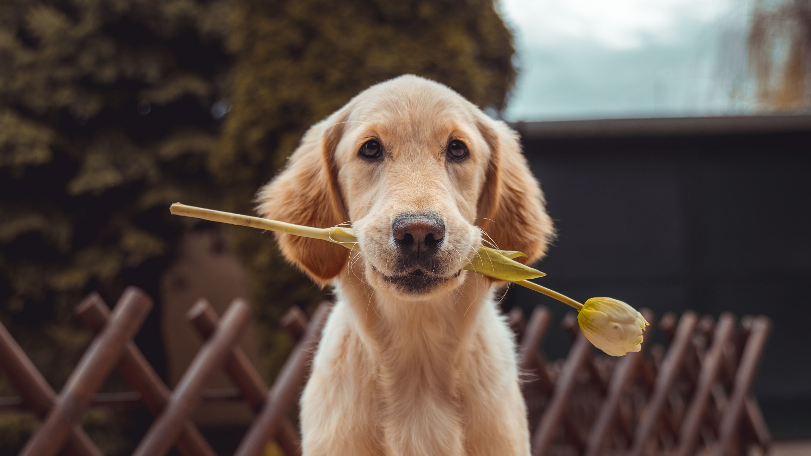

# Introduction

This is Min Zhao

My hobbys are:

1. Running
1. Programming
1. Listen to music
1. Pets
   - Dogs
   - Cats
   - birds

My hobby is not ~~singing~~. I **love** to play with pets. And when I am using technical terms put them in _italics_.

The website of my favorite professor is from [Ulrich Anders](https://ulrich-anders.eu).

My students seem to love dogs. For instance, this one:

