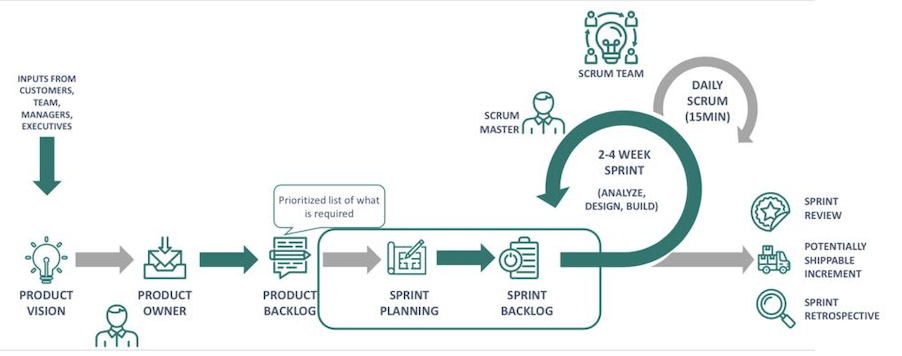
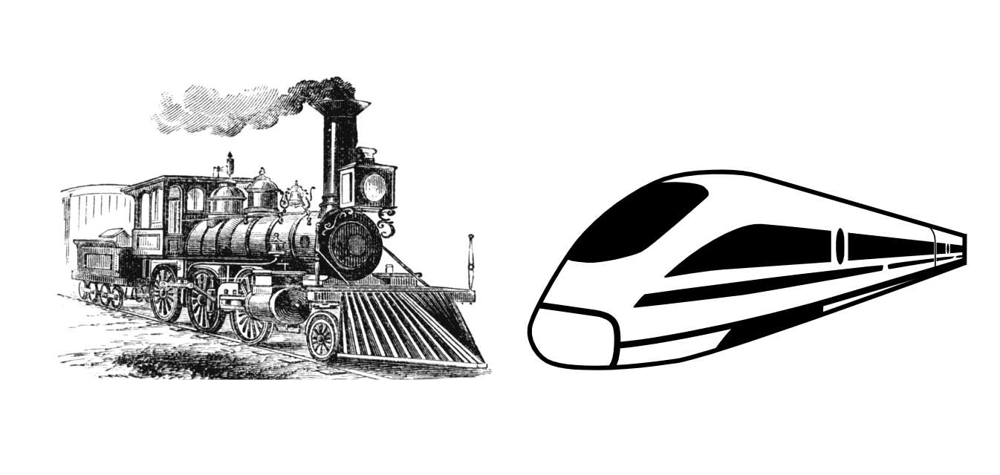
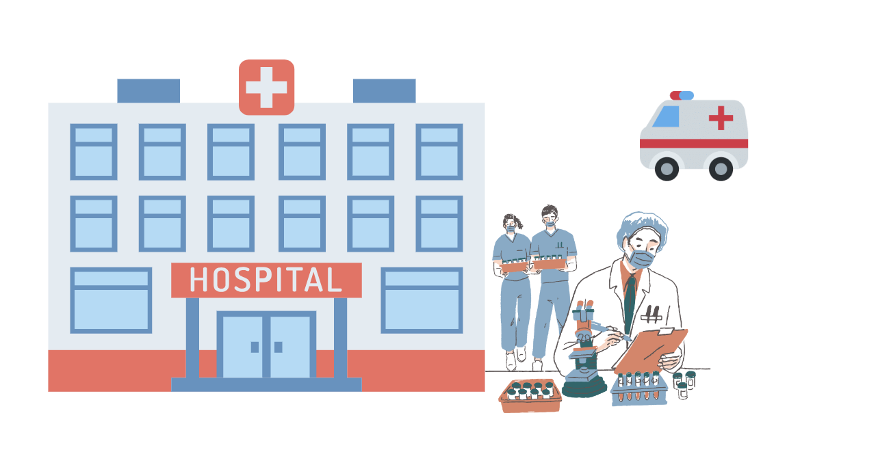

# Agile organization
## Min Zhao
## 29/11/2023
---
 #           WHAT

## What is agile 
## What is agile organization
## What is the difference between agile and scrum

---

# Agile
A way of working 

A mindset

---

 # Agile Organization
Possesses the ability to make timely, effective and sustained organisational changes.

Agile is a result

---
- Empower
- Creating a good environment
- Autonomous

---
- sense of mission
- Addressing the problems of rigid organisational structures, inefficiencies and lack of talent emergence etc.
---
 # Difference Between Agile and Scrum
**Agile exists in scrum and scrum can help organisations become agile, but there is more to agile methods than just scrum.**

---

---
 # WHY
Why must organisations become agile?

---
 - Rapidly changing external environment
 - uncertainties
 - Less efficient
 - Rapid development
 - Sustainable human resources development
 
---

---
# HOW
1. How to become an agile organisation
2. How to measure whether an organisation is really agile

---

#  How to become an agile organisation
- Everyone in the organisation has to change their mindset
- Companies need to pursue not only productivity but also customer satisfaction

---

- The team must respond quickly to customer requests
- Multi-sectoral teamwork
- Short working cycles
- Horizontal management

---

#  Example or story

---
# How to measure whether an organisation is really agile
1. Assessing Agile Team Functionality
2. Measure the leadership team's response or attitude to Agile

---
# How to measure whether an organisation is really agile
3. Exploring barriers to agile functioning
---
# Thanks

